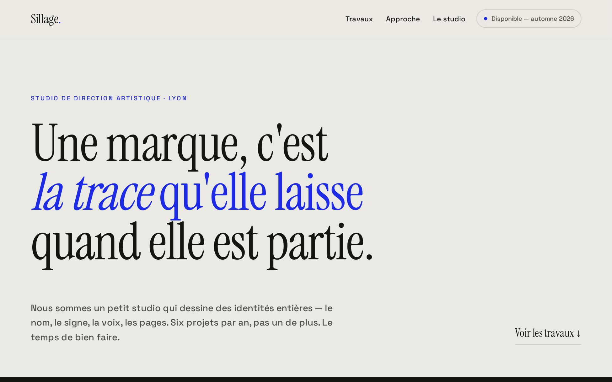

<div align="center">

# ✷ Sillage

### Portfolio d'un studio de direction artistique — **zéro dépendance.**


[](https://matgordfr.github.io/sillage-demo/)

<br>

[](https://matgordfr.github.io/sillage-demo/)

</div>

> [!NOTE]
> **Projet démo.** Le studio, les projets et les personnes sont **fictifs** — c'est une vitrine de savoir-faire front-end. Tout tourne dans le navigateur, sans backend.

---

## ✨ Ce que ça montre

Un **portfolio de studio créatif** immersif et éditorial :

- **Un curseur sur mesure** — un point qui suit la souris avec inertie et grossit au survol des projets (mode `blend`), désactivé au tactile et en `reduced-motion`.
- **Des affiches génératives** — chaque projet du portfolio reçoit une **couverture riso unique, dessinée au chargement** (formes, duotone, grain, grande initiale typographiée) à partir d'une graine déterministe. Aucune image externe.
- **Une typographie qui porte la page** — Instrument Serif en grand, avec des italiques pour les accents.
- **Une vraie structure d'agence** — travaux, approche en 3 temps, le studio, contact.

## 🎨 Le craft

- **Identité distinctive** — porcelaine froide + ultramarine (Klein), loin des gabarits attendus.
- **Polices auto-hébergées** — Instrument Serif (display) + Space Grotesk (UI & corps).
- **Graphismes générés en SVG** — les affiches sont construites en `createElementNS`, sans `innerHTML`.
- **Accessible & responsive** — navigation clavier, focus visible, `prefers-reduced-motion` respecté, du grand écran au mobile.

## 🛠️ Stack


Aucun framework, aucune librairie, aucun CDN. ~100 Ko, polices comprises.

## 📁 Structure

```
index.html             → la page
assets/css/studio.css  → design system + curseur + galerie
assets/js/studio.js    → curseur custom + affiches génératives + reveals
assets/fonts/          → Instrument Serif + Space Grotesk (auto-hébergées)
```

## 🚀 Lancer en local

```bash
python3 -m http.server 8000
# puis http://localhost:8000
```

## 👤 Auteur

Réalisé par **[MatgordFR](https://github.com/MatgordFR)** — dev indépendant (bots Discord, sites, IA).
🌐 [matgord.com](https://matgord.com) · 🐦 [@matgordfr](https://x.com/matgordfr) · 🎨 [les autres démos](https://matgordfr.github.io/matgord-portfolio-demos/)

## 📄 Licence

[ISC](LICENSE) — libre d'usage.
